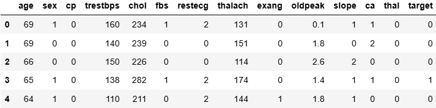

# 🌟 Heart Disease Prediction System 🌟

Welcome to the **Heart Disease Prediction System**, a website designed to predict the likelihood of heart disease using multiple machine learning models and provide insightful visualizations for analysis.

---

## 🚀 Features

- **Prediction Models**: Displays results from multiple ML models (Logistic Regression, KNN, Random Forest, etc.).
- **Interactive Visualizations**:
  - ROC curves and AUC scores.
  - Confusion matrices.
  - Model accuracy comparison graphs.
  - Feature correlation heatmaps.
  - Age distribution histograms.
  - Target class bar charts.
- **Dynamic Results**: All model predictions and performance metrics displayed on a single page.
- **User-Friendly Interface**: Intuitive and responsive design for smooth navigation.

---

## 🛠️ Technologies Used

- **Frontend**: HTML, CSS, JavaScript.
- **Backend**: PHP.
- **Database**: MySQL.
- **Machine Learning**: Python (using `predict.py`).

---

## 📸 Screenshots

### 🏠 Homepage


### 📊 Results Page


### 📊 Solution Page


### 📈 Data


---

## 📂 File Structure

├── index.html # Main webpage   
├── submit.php # Backend logic for handling form submissions   
├── predict.py # Python script for ML model predictions   
├── graphs/ # Generated visualizations   
└── README.md # Project documentation  

---

## 📊 Visualizations

### 🧮 Correlation Heatmap


### 📈 Distributions


---

## 🖥️ How to Run Locally

### Prerequisites
1. Install [XAMPP](https://www.apachefriends.org/index.html) or any PHP server.
2. Install Python 3.x and required libraries: `pip install -r requirements.txt`.
3. Clone the repository:
   ```bash
   git clone https://github.com/JG-2703/heart-disease-prediction.git

---
   
### Steps

- Start your PHP server (e.g., XAMPP).  
- Place the project folder in the htdocs directory.  
- Run the Python script predict.py to generate model predictions.  
- Access the website via http://localhost/Heart_Disease_Prediction/index.php.  

---

### 🧑‍💻 Future Enhancements
Add deep learning models for improved predictions.  
Enable real-time data input from medical devices.  
Deploy the website on cloud platforms like AWS or Azure.  

---

### 🤝 Contributing
Contributions are welcome! To contribute:  

Fork this repository.  
Create a new branch: git checkout -b feature-name.  
Commit your changes: git commit -m 'Add feature-name'.  
Push to the branch: git push origin feature-name.  
Submit a pull request.  

---

### 🌟 Show Your Support
If you like this project, please consider giving it a ⭐️ on GitHub!

---

### 📧 Contact
Feel free to reach out for any queries or suggestions:  
Jagriti Gangwar  
📍 Uttarakhand  
📧 Email: jagritigangwar2703@gmail.com  
